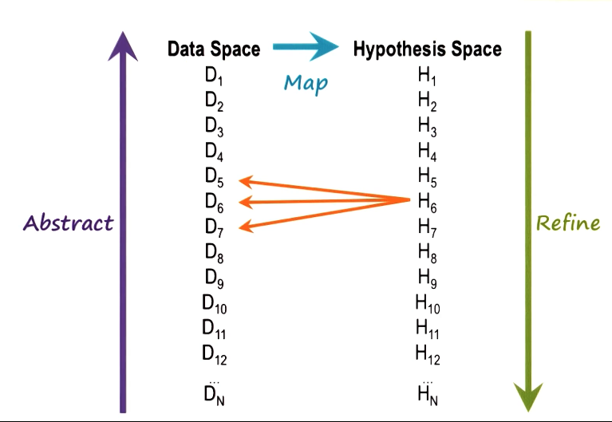

Principle of parsimony: Simplest possible explanation

## Defining Doagnosis

Diagnosis: To determins what is wrong with a malfunctioning device
or the mapping of the data space to the hypothesis space

- Malfunction is a discrepancy between expected results and observed results

## Data and Hypothesis Spaces

- The data space is all of the observed data
- The hypothesis space is a hypothesis to explain the observed data
- Mapping the data space to the observed space can be very difficult

### Heuristic Classification

- Bottom up classification processing follows the abstract arrow
- top down classification processing follows refine arrow

## Mapping Data to Hypothesis

Mapping needs to take place from data-space to hypothesis space, and additionally from the hypothesis space to the data space

### Difficulties

1) One data point, multiple hypothesis
2) One hypothesis may explain multiple data points
3) Multiple hypothesis multiple sets of data
4) Mutually exclusive hypothesis
5) Interacting data points (data points cancelling each other out)

## Two Views of Diagnosis

### Classification

Mapping data onto hypothsis

### Abduction

Rule: Cause -> Effect

Rule: Bob hates Joe
Cause: Bob walks in
Effect: Joe leaves

### Fundamental Forms of Inference

- Deduction: Given the rule and the cause, deduce the effect
  - Modus pollen
- Induction: Given a cause and effect, induce the rule
- Given a rule and effect, abduce a cause

### Choosing a Hypothesis

1) Hypothesis must cover as much of the data as possible
2) The smallest number of hypothesis out to be used, Principle of parsimony
3) Some hypothesis may be more likely than others

