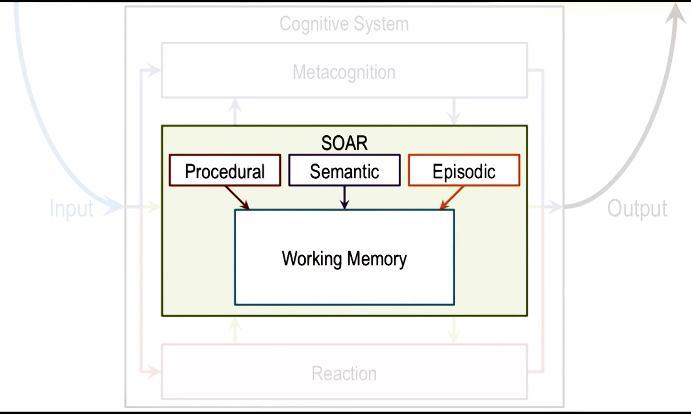

## Cognative Architecture

- A cognative agent is a function `f` that maps a perceptual history `P*` to an action `A`.
- Percepts -> Actions
- The `*` stands for "history"

$$
f: P^* \rightarrow A
$$

Assumptions of Cognative Architectures:

- Goal-oriented
- Rich, complex environments
- Significant knowledge
- Represented at a level of abstraction, symbols
- Respond flexibly to a changing environment
- Learn from their experiences

$$
\text{Architecture} + \text{Content} = \text{Behavior}
$$

If architecture is fixed, then we only need to change the knowedge content of the agent to achieve different behaviors.

### SOAR

Consists of a **long term memory** portion

- Procedural knowledge (how to pour water into a container)
- Semantic knowledge (concepts and models of the environment, model of how a plane flies in the air)
- Episodic knowledge (events, think what was for dinner yesterday)

and **short term memory**

- Working memory

## Production Systems

Levels of Abstraction:

- **High** - Task / Knowledge Level
- **Mid** - Algorithm / Symbol Level
- **Low** - Hardware / Implementation Level

- Low level provides architecture for higher levels up ladder
- High level provides content for lower levels down ladder

Working Memory Cycle

- Working memory is the state of the system
- Long term memory can consist of "production rules"
- Based on long-term memory some rules get activated
- Rules which are activated consequences get established
- Consequences that are established mutate working memory

If SOAR reaches a state that it cannot determine an action for, it will envoke episodic knowledge to try and learn a new behavior

## Action Selection

Mapping percepts in the world into actions

- Percepts from the world into a pitch selection

## Chunking

- A **learning technique** that SOAR uses to overcome impasses
- Uses episodic memory to find an event in the past that is related to current percepts and leverages the previous event into a new rule

## Misc

Reasoning first, then work backwards to learning
