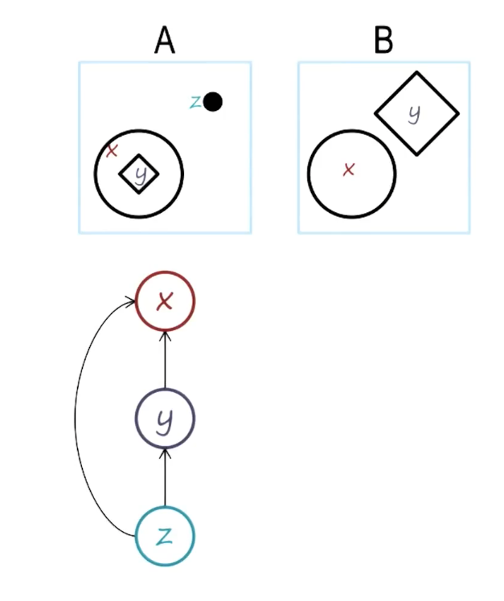
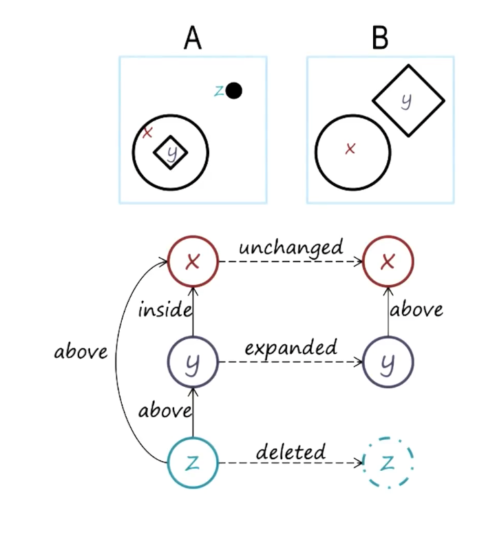

## What is a Knowledge Representation?

- Language, which has a vocabulary
- Content, which goes into a representation, expressed in aforementioned language

1) We identify each object, X, Y and Z

2) Represent the relationship between the objects

The language of this semantic network are:

- X, Y, Z
- above, inside
- expanded, unchanged, deleted, (contracted?)

## Structure of Semantic Networks

- Lexicon
- Structure
- Semantics

Relating to the above example:

- Lexicon: Nodes (X, Y, Z)
- Structure: Directional Links (digraph/dag?)
- Semantics: Application-specific labels

## Represent and Reason

- Represent different shapes
- Reason about what transformations can be done to the shapes

### Weights w/ Represent and Reason

There can be multiple partially of fully correct answers, we can assign weights to each transformation to be able to score which would be more likely to be chosen.
