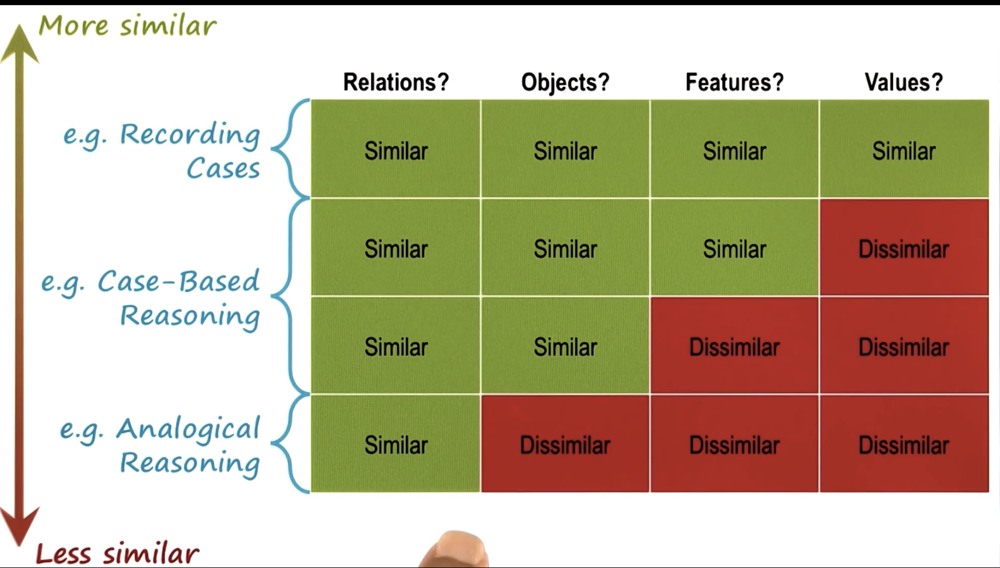
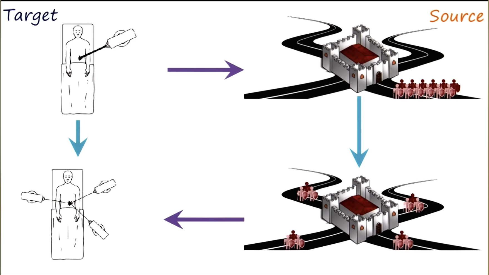
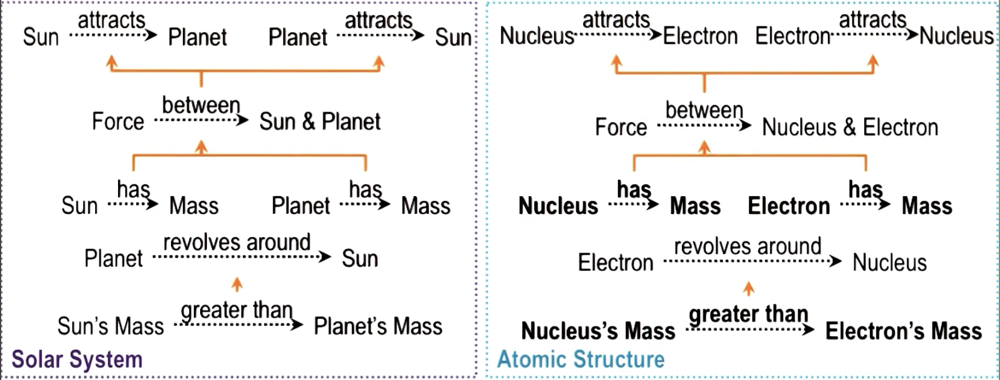

- Represented by two objects connected by a relationship
  - features of objects and values of features of objects can create similarity as well

## Cross Domain Analogy

patient/laser problem relation to army/road problem

### Similarity

- Superficial: deals with features, counts, objects
- Deep: deals with relationships between objects, relationships between relationships

- Semantic: conceptual similarity between target and source case
- Pragmatic: similarity of **external** factors, such as goals
- Structural: similarity between representational structures

## Phases

Case base reasoning is very similar to analogical reasoning, but analogical reasoning has a mapping and transfer step in addition.

### Retrieval

When talking about the relationship of an electron to a neutron in an atom, retrive example of planet relationship to sun in the solar system.

Type of similarity is important, see ##Similarity

case-based reasioning would likely only pull superficially similar or deeply and superficially similar analogies.

### Mapping

What in the source problem pertains to what in the target problem.

Solve the correspondence problem:

- give higher-order relationships priority over lower-order relationships
- 18.11 lecture
- patient/army analogy mapping should be based on goal. Army's goal is to kill king, laser's goal is to kill tumor

### Transfer

Once correspondence has been established:
induce a pattern of relationships

- goal: kill king / remove tumor
- obsticle: road mines / healthy tissue
- resource: soldiers / lasers
- strategy: decompose resource, arrive at location at the same time

In a graphical representation, the vertices represent the objects and features, the edges are representing relationships

### Evaluation

Evaluation can reach out to prior states, such as retrieval, mapping or transfer to help a source get closer to the goal.

### Storage

Store case and solution as a source case and keep for case-based reasoning

## Compound Analogy

Use parts of several analogies to combine into one source.

## Issues w/ Analogical Reasoning

- different cases may not have common vocabulary
- Abstraction and transformation
- Compound and compositional analogies
- Visuospacial analogies
- Conceptual combination
