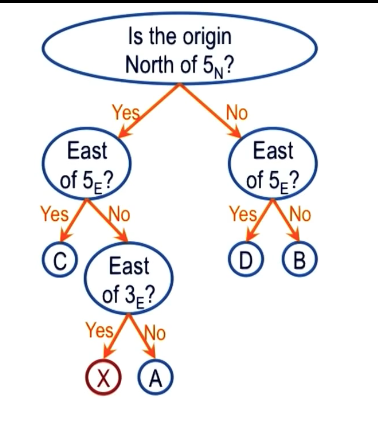

Process of case-based reasoning:

1) Retrieval: think knn for retrieving a recorded case
2) Adaptation: Adapt the prior solution to fit the current problem
3) Evaluation: How well will the adapted solution address the current problem
4) Storage: Store new case back into case-based reasoning repository

Assumptions:

- Patterns exist in the world
- Similar problems have similar solutions

Failed cases are useful to store as well

## Adaptation

problem: Get from point A to point C

### Model Based Method

1) Retrieval finds a route from A to B
2) Adaptation continues from B to C using a model of the streets
3) Evaluation shows that A to C is satistied

### Recursive retrieval

1) No route from A to C
2) Retrieve route from A to B (partial solution)
3) Make new problem: Find route from B to C
4) Retrieve route from B to C

### Heuristics / Rules

problem: Get from point C to point A

1) Retrieve route from A to C
2) Reverse route to C to A - This may not work (think 1-way streets)

## Storage

### Indexing

- route beginning x, y coordinates can be index key
- Additionally, things like speed, scenic, etc can be added to make a richer index

### Discrimination Tree

A binary search tree of yes/no answers. Every time that a single node has multiple
branches pointing to it a new y/n question is created to split them.

Doesn't have to be a binary tree, however each leaf has to have only one branch to it.

