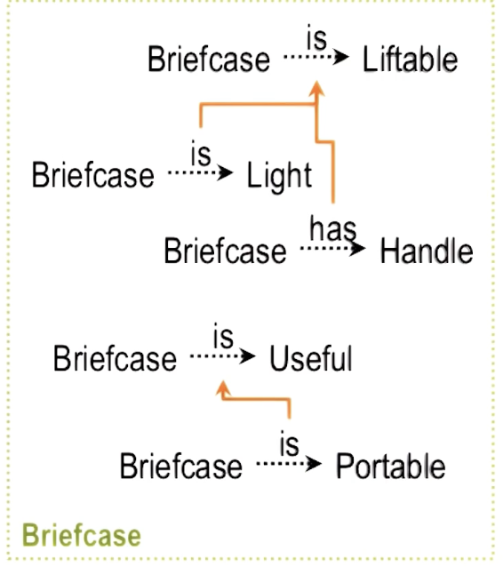
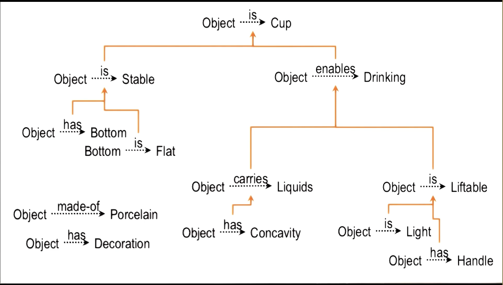

The problem being discussed is what object could substitute for a cup if  no cups are available...

## Concept Space

How does an agent determine if an object can work as a cup:

Prior knowledge of cups:

- Object -> has -> Bottom
  - Bottom -> is -> Flat
- Object -> made-of -> Porcelain
- Object -> has -> Decoration
- Object -> has -> Concavity
- Object -> is -> Light
- Object -> has -> Handle

Agent wants to prove:

- Object -> is -> Cup

A prior knowledge relationship looks like this:

Where the yellow arrows indicate causality

## Abstraction

AI agent has to abstract from other concepts to a concept that it can use for any object.

1) A cup must be stable
2) A brick is stable because it has a flat bottom
3) A cup is stable because it has a flat bottom, like a brick

## Analogical Transfer

