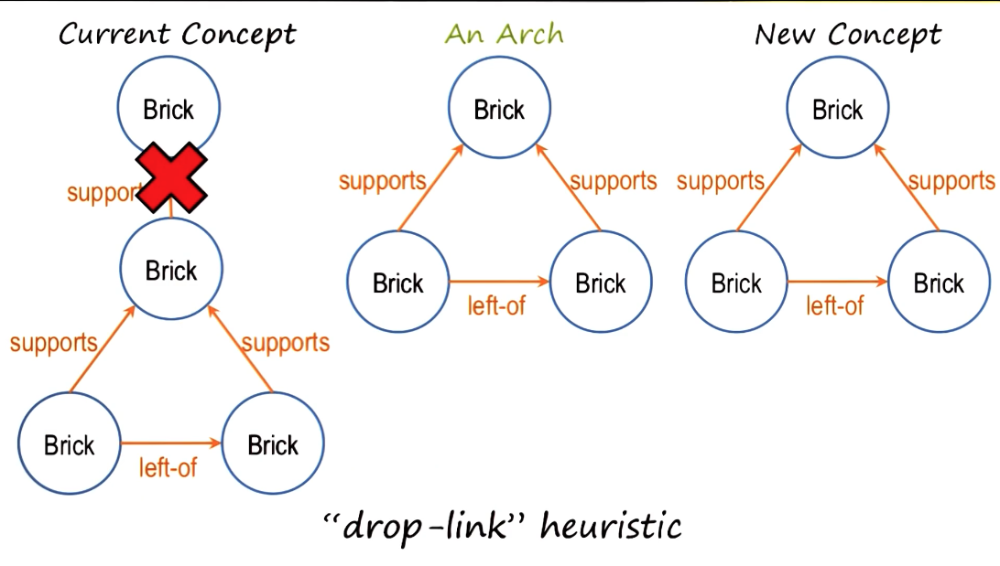

- Makes strong use of background knowledge

1) Learning is incremental
2) Examples are labeled (supervised)
3) Examples can come in a particular order, positive then negative maybe
4) Different from case-based reasoning as it uses abstract concepts
5) Number of examples to abstract concepts from is small
6) Generalize / Specialize trade-off

## Variabilization

Take a concrete concept like bricks stacked like a house and create abstract variables
like Brick and relationships like supports and left-of

## Specialization

- **Require link heuristic**, where some links are necessary to represent things not represented by a negative supervised example
- **Forbid Link Heuristic**, opposite of require link, shows as logical not in link name

## Generalization

- **Drop link heuristic**, where we want to drop a link to turn somethin from too specific to more general is shown in [Variabilization](#variabilization)
- **Enlarge-Set Heuristic**, where a node is combined to be several possible types
- **Climb-Tree Heuristic**, where a type has inheritance, a block is an example of a brick or a wedge. IMPORTANT THIS IS DIRECTED AND **NOT BI-DIRECTIONAL**
- **Close-Interval**, expand range of values to be a positive example of the concept

## Heuristics for Specialization and Generalization

