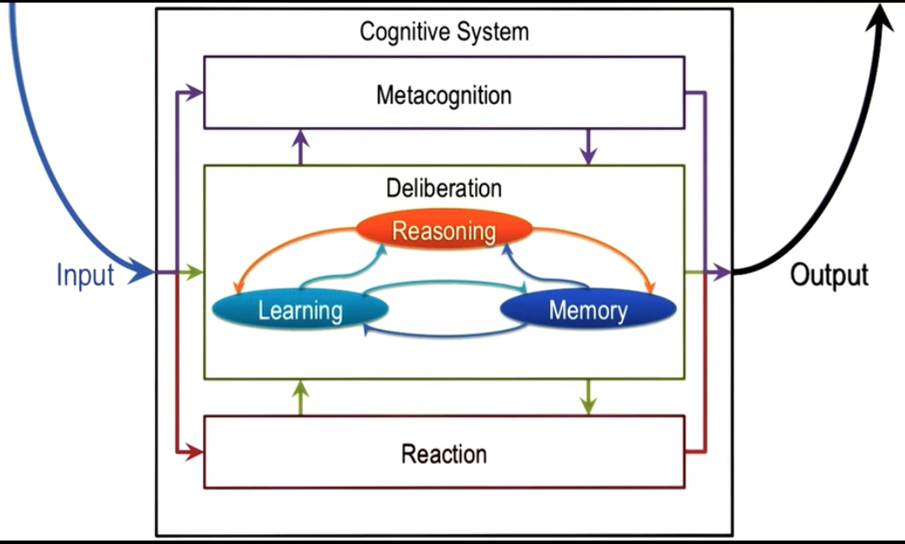

[Homepage](https://lucylabs.gatech.edu/kbai/summer-2023/)

[Lectures](https://omscs.gatech.edu/cs-7637-knowledge-based-artificial-intelligence-course-videos)

## Intro to KBAI

Characteristics of AI Problems

- Knowledge arrives incrementally
- Problems exhibit recurring patterns
- Problems have multiple levels of granularity
- Problems are computationall intractable
- The world is dynamic, but knowledge is static
- The world is open-ended, but knowledge is finite

Characteristics of AI Agents

- Limited computing power
- Limited sensors
- Limited attention
- Computational logic is fundamentally deductive
- Agent knowledge is incomplete relative to the world

### Knowledge Representations

- [Semantic Networks](./School.KBAI.Fundamentals.Semantic_Networks.md)

### Problem Solving Techniques

- [Generate & Test](./School.KBAI.Fundamentals.Generate_and_Test.md)

### Architectures

- 

### Fundamental Processes of KBAI Cognative Systems

- "Cognative" means dealing with human-like intelligence
- *Cognative system and KBAI-agent are used interchangably*
- Deliberation, Meta-Cognition and Reaction make the three-layer system

#### Deliberation

Reasoning about the world around us.

- Reasoning
- Learning
- Memory: Knowledge gained from learning needs to be stored

think of being in traffic and wanting to change lanes. Requires planning

#### Meta-cognition

Reasoning about deliberation or reaction.

Lane-change results in another car honking at you. You need to reason about the cause of the sub-optimal result.

#### Reaction

- A direct mapping from perception to action

### Kinds of KBAI

- Think/Act
- Optimally/Like Humans

- Think like humans: Semantic Web
- Think optimally: Machine Learning
- Act like humans: Improvisational Robotics
- Act optimally: Airplane Auto-pilot

### Principles of KBAI

- KBAI agents represent and organize knowledge into knowledge structures to guide and support reasoning
- Learning in KBAI agents is often incremental
- Reasoning in KBAI agents is top-down as well as bottom-up
- KBAI agents match methods to tasks
- KBAI agents use heuristics to find solutions that are good enough, though not necessarily optimal
- KBAI agenbts make use of recurring patterns in the problems they solve
- The architecture of KBAI agents enables reasoning, learning and memory to support and constrain each other
